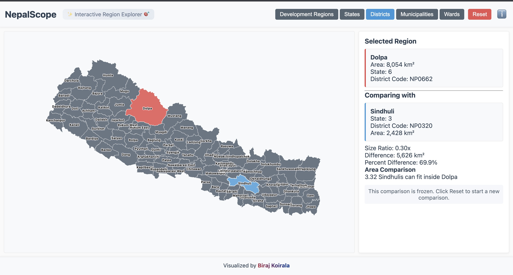
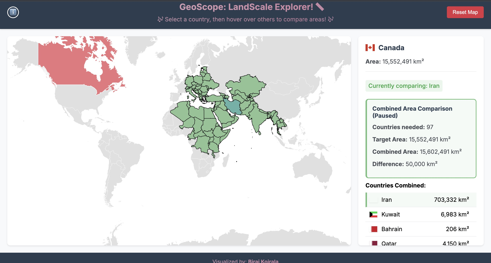
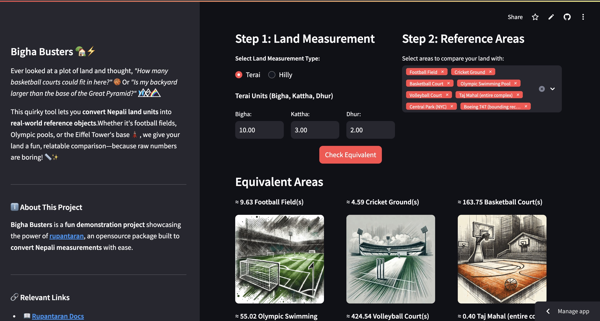

# Visualization Collection

A curated collection of interactive data visualizations created by <a href="https://birajkoirala.com.np" target="_blank">Biraj Koirala</a>.

## Overview

This repository hosts a collection of interactive data visualizations focusing on geographical comparisons and measurement conversions. Each visualization is designed to make complex data more accessible and engaging.

## Visualizations

### 1. NepalScope

An interactive tool for exploring Nepal's administrative divisions. Compare different administrative levels, from development regions down to individual wards.

- **Technologies**: D3.js
- **Features**: Compare Districts
- **Demo**: <a href="https://biraj094.github.io/viz/viz1/" target="_blank">Launch NepalScope</a>

### 2. GeoScope

An interactive geographical visualization tool that enables direct visual comparisons between countries. Perfect for understanding relative sizes of different nations.

- **Technologies**: D3.js
- **Features**: Compare Countries
- **Demo**: <a href="https://biraj094.github.io/viz/viz2/" target="_blank">Launch GeoScope</a>

### 3. Bigha Busters

A fun and practical tool that converts Nepali land units into relatable real-world references. Built using <a href="https://github.com/biraj094/rupantaran" target="_blank">rupantaran</a>, an open-source Python package for Nepali measurement conversions.

- **Technologies**: Streamlit, Python
- **Features**: Land Conversion
- **Package**: <a href="https://github.com/biraj094/rupantaran" target="_blank">rupantaran</a> (<a href="https://rupantaran.readthedocs.io/en/latest/" target="_blank">Documentation</a>)
- **Demo**: <a href="https://bigha-busters.streamlit.app/" target="_blank">Launch Bigha Busters</a>

## License

© 2024 Biraj Koirala. All rights reserved.